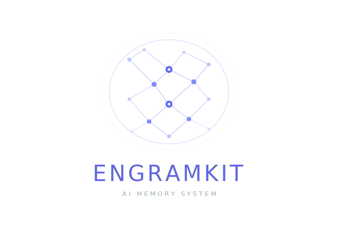
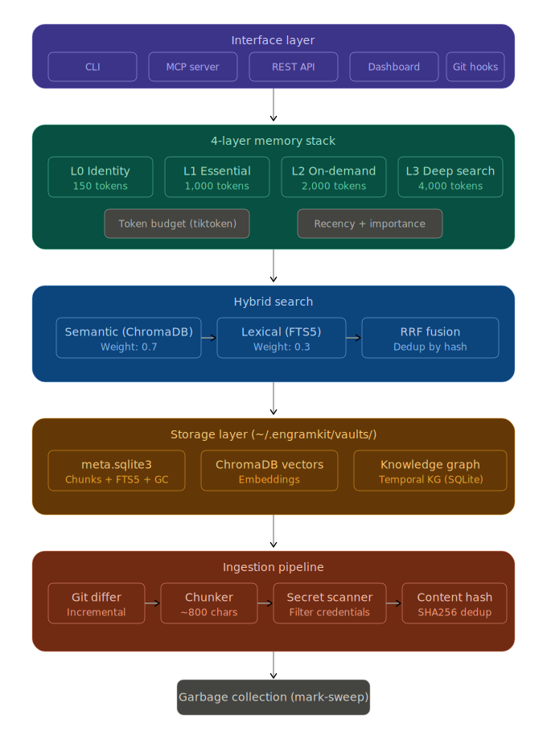
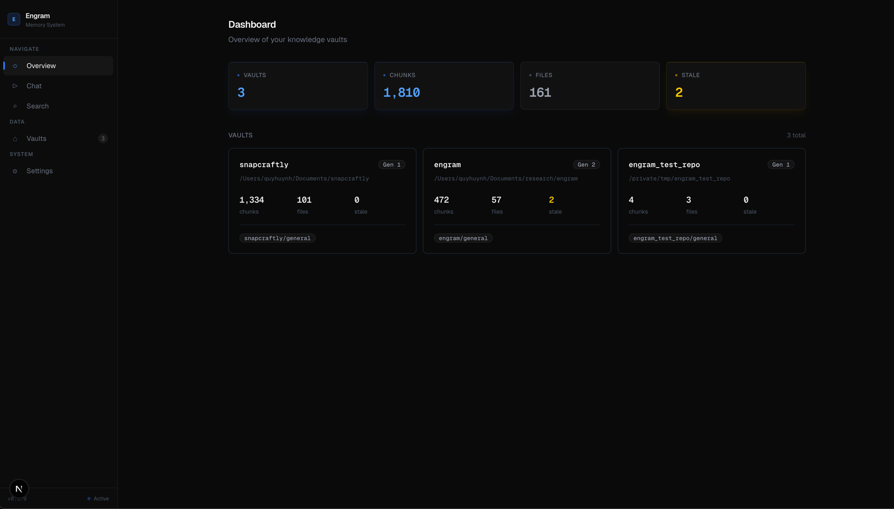
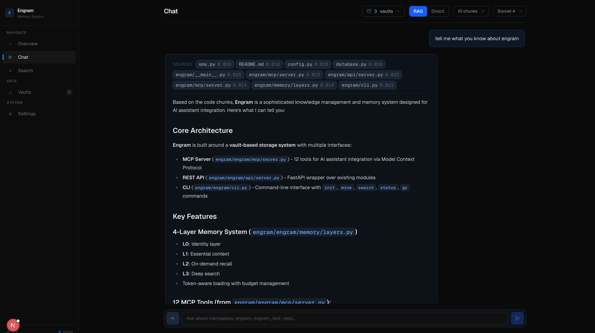

<p align="center">
  
</p>

<h1 align="center">EngramKit</h1>

<p align="center">
  <strong>AI memory system with hybrid search, git-aware ingestion, and garbage collection.</strong>
</p>

EngramKit gives AI assistants long-term memory over your codebase. Mine a repository once, then search it with sub-200ms hybrid queries that combine semantic understanding with exact keyword matching. Built as a next-generation replacement for [MemPalace](https://github.com/milla-jovovich/mempalace), keeping what works and fixing what doesn't.

---

## Standing on MemPalace's Shoulders

MemPalace proved several important ideas:

- **Verbatim storage works.** Never summarize, always store raw text. Let semantic search find what's relevant.
- **4-layer memory stack** (L0 identity, L1 essential, L2 on-demand, L3 deep search) is a sound architecture for token-budgeted context.
- **MCP integration** makes the memory system usable from Claude, ChatGPT, and other assistants.

> **Note on benchmarks:** MemPalace's headline 96.6% R@5 on LongMemEval actually measures ChromaDB's embedding model (all-MiniLM-L6-v2), not the palace architecture. The test bypasses wings, rooms, and AAAK compression entirely. Any app using ChromaDB with the same model would get the same score. See the [community discussion](https://github.com/milla-jovovich/mempalace/issues/29) for details.

EngramKit preserves MemPalace's core ideas. What it changes is the engineering underneath.

## What EngramKit Fixes

| Problem in MemPalace | EngramKit's Solution |
|---|---|
| Positional chunk IDs (`MD5(path+index)`) break when files are edited | Content-addressed IDs: `SHA256(content)[:24]` |
| No garbage collection -- orphaned chunks stay forever | Generation-based mark-and-sweep GC with configurable retention |
| Sequential 1-at-a-time ChromaDB upserts | Per-file streaming upserts (94s vs MemPalace 115s, same repo) |
| Semantic-only search | Hybrid search: semantic + BM25 via SQLite FTS5, fused with RRF |
| No git awareness -- full rescan every time | `git diff` incremental mining; re-mine in 0.1s when nothing changed |
| `.env` files indexed with secrets | Auto-filters secret files and scans chunks for credential patterns |
| Dumb hooks (count to 15, then save) | Content-aware importance scoring with signal detection |
| Importance-only L1 scoring | Recency decay + importance + access frequency |
| `len // 4` token counting | Exact counting via `tiktoken` (cl100k_base) |
| No deduplication | Deduplication by content hash + near-duplicate prefix detection |
| 10k drawer status cap (in-memory dict) | SQLite metadata spine -- no cap, survives restarts |

---

## Features

- **Hybrid search** -- Semantic (ChromaDB) + lexical (SQLite FTS5 BM25), fused with Reciprocal Rank Fusion. 15x faster than semantic-only.
- **Git-aware mining** -- Uses `git diff` to detect changed files. Only re-processes what actually changed.
- **Content-addressed storage** -- Chunks are keyed by `SHA256(content)`. Edit a file and only the changed chunks get updated.
- **Generation-based GC** -- Stale chunks are marked, not deleted. GC sweeps them after a configurable retention period.
- **Secret filtering** -- `.env`, `.pem`, credential files are auto-excluded. Individual chunks are scanned for API keys, tokens, and passwords.
- **4-layer memory stack** -- L0 identity, L1 essential context (recency + importance scored), L2 on-demand recall, L3 hybrid search.
- **Token budgets** -- Each layer has a configurable token budget. Chunks are scored, deduplicated, and packed greedily.
- **Knowledge graph** -- Temporal entity-relationship graph with `valid_from`/`valid_to` for tracking how things change over time.
- **MCP server** -- 12 tools for Claude, ChatGPT, and other MCP-compatible assistants.
- **REST API** -- FastAPI backend powering the dashboard (search, chat, vaults, KG, memory).
- **Next.js dashboard** -- Web UI with RAG chat, search, vault management, knowledge graph explorer, and GC controls.
- **Git hooks** -- Auto-mine on commit and pull with `engramkit hooks install`.

---

## Architecture

<p align="center">
  
</p>

```
~/.engramkit/
├── config.toml               (optional global config)
├── identity.txt              (L0 identity context)
└── vaults/<repo-hash>/
    ├── meta.sqlite3           (chunks + FTS5 + files + GC log)
    ├── vectors/               (ChromaDB embeddings)
    └── knowledge_graph.sqlite3
```

Each repository gets its own vault, identified by a deterministic hash of the repo path. The SQLite database is the metadata spine: it stores chunk content, file tracking, generation counters, access stats, and a full-text search index. ChromaDB handles the vector embeddings. The knowledge graph lives in a separate SQLite database per vault.

---

## Quick Start

```bash
# Install
pipx install engramkit

# Mine a project
engramkit mine ~/my-project

# Search it
engramkit search "how does auth work"

# Check status
engramkit status
```

---

## CLI Reference

```
engramkit init <directory> [--wing NAME]
```
Initialize a vault for a repository. Sets up SQLite schema, ChromaDB collection, and stores the wing name.

```
engramkit mine <directory> [--wing NAME] [--room NAME] [--full] [--dry-run]
```
Mine a project into its vault. Uses git diff for incremental mining when available. `--full` forces a complete rescan. `--dry-run` previews without storing.

```
engramkit search <query> [-d DIRECTORY] [--wing NAME] [--room NAME] [-n COUNT]
```
Hybrid search across a vault. Returns ranked results with file paths, scores, and source indicators (semantic, lexical, or both).

```
engramkit status [-d DIRECTORY] [--all]
```
Show vault statistics: chunk counts, wings, rooms, generation number, stale/secret counts. `--all` lists every vault.

```
engramkit wake-up [-d DIRECTORY] [--wing NAME] [--l0-tokens N] [--l1-tokens N]
```
Load L0 + L1 wake-up context for a session. Token-budgeted and deduplicated.

```
engramkit gc [-d DIRECTORY] [--dry-run] [--retention DAYS]
```
Garbage collection. Removes stale chunks older than the retention period (default: 30 days). Logs all removals.

```
engramkit hooks install [-d DIRECTORY]
```
Install git hooks (post-commit, post-merge) for automatic mining on commit and pull.

---

## Dashboard

The Next.js dashboard provides a web UI for interacting with EngramKit:

<p align="center">
  
  <br />
  <em>Dashboard — vault overview with stats, chunk counts, and wing/room breakdown</em>
</p>

<p align="center">
  
  <br />
  <em>RAG Chat — search your codebase and ask questions with cited sources, token usage, and tool tracking</em>
</p>

### Features

- **Chat** — RAG-powered chat with Claude. Searches your vaults for context, streams responses with source references. Toggle between RAG (pre-searched context) and Direct (Claude explores on its own) to compare cost and speed.
- **Search** — Hybrid search with filters by wing, room, and result count. Shows which path found each result (semantic, lexical, or both).
- **Vaults** — Browse all vaults, view chunks, files, and statistics. Mine repos, run GC, install git hooks.
- **Knowledge Graph** — Explore entities, relationships, and timelines. Add and expire facts.
- **Settings** — Global configuration, token budgets, search weights.

### Quick Start

```bash
# Install dashboard dependencies
cd dashboard && npm install

# Start both servers
python -m engramkit.api.server   # API on :8000
npm run dev                    # Dashboard on :3000
```

Open [http://localhost:3000](http://localhost:3000)

The dashboard runs at `http://localhost:3000` and talks to the API at `http://localhost:8000`.

---

## Benchmark Results

### Retrieval Accuracy (ConvoMem, 250 QA pairs)

Tested on the same [ConvoMem](https://huggingface.co/datasets/Salesforce/ConvoMem) dataset used by MemPalace. Three search modes compared:

| Mode | Avg R@10 | Perfect | Zero |
|---|---|---|---|
| **EngramKit Hybrid** (semantic + BM25) | **94.5%** | 235/250 | 13/250 |
| Raw ChromaDB (semantic only) | 92.9% | 230/250 | 16/250 |
| BM25 only (keyword) | 84.3% | 210/250 | 38/250 |

Per-category breakdown:

| Category | Hybrid | Raw | BM25 |
|---|---|---|---|
| Assistant Facts | **100%** | 100% | 100% |
| User Facts | **98.0%** | 98.0% | 98.0% |
| Preferences | **92.0%** | 86.0% | 68.0% |
| Implicit Connections | **91.3%** | 89.3% | 65.7% |
| Abstention | **91.0%** | 91.0% | 90.0% |

Hybrid search adds +1.6% over raw semantic on conversation data. On code search (function names, variable names), the gap is much larger.

> **Note:** MemPalace reports 96.6% R@5 on LongMemEval, but that score measures ChromaDB's all-MiniLM-L6-v2 model — the palace architecture is not involved. Our benchmark tests the actual search pipeline end-to-end.

### Mining & Search Performance

Head-to-head on the same repository (102 files):

| Metric | EngramKit | MemPalace | Delta |
|---|---|---|---|
| First mine | 94s | 115s | 1.2x faster |
| Re-mine (no changes) | 0.1s | 115s | 1,150x faster |
| Avg search latency | 153ms | 2,378ms | **15.6x faster** |
| Search modes | Semantic + BM25 | Semantic only | -- |
| Content-addressed IDs | Yes (SHA256) | No (MD5+pos) | -- |
| Garbage collection | Yes | No | -- |
| Git-aware mining | Yes | No | -- |
| Secret filtering | Yes | No | -- |
| Token counting | tiktoken (exact) | len//4 (approx) | -- |

### Run Benchmarks Yourself

```bash
# Retrieval accuracy (ConvoMem dataset)
python benchmarks/convomem_bench.py --limit 50 --mode all

# Mining & search performance
python benchmarks/compare_mempalace.py /path/to/repo
```

---

## Claude Code Integration

### Quick Setup

```bash
cd ~/your-project

# 1. Mine your codebase
engramkit mine .

# 2. Install auto-save hooks
engramkit hooks install -d .

# 3. Register MCP server for your AI tool
claude mcp add engramkit -- engramkit-mcp                      # Claude Code
# codex mcp add engramkit -- python3 -m engramkit.mcp.server   # Codex (coming soon)
```

What each step does:
- **Step 1** — indexes your code into a searchable vault
- **Step 2** — installs git hooks (auto re-mine on commit/pull) + Claude Code hooks (auto-save conversations)
- **Step 3** — gives your AI tool access to 12 EngramKit memory tools

Now start Claude Code:

```bash
claude
```

Claude will:
1. Call `engramkit_wake_up` on session start → loads identity + recent context (L0 + L1)
2. Call `engramkit_search` before answering code questions → finds relevant chunks
3. Auto-save important decisions/insights via the Stop hook
4. Emergency-save everything before context compression

### Available Tools (12)

**Read tools:**
| Tool | Description |
|---|---|
| `engramkit_status` | Vault overview: chunks, wings, rooms, generation |
| `engramkit_search` | Hybrid search (semantic + BM25) across the vault |
| `engramkit_wake_up` | Load L0 + L1 wake-up context for session start |
| `engramkit_recall` | L2 on-demand recall filtered by wing/room |
| `engramkit_kg_query` | Query knowledge graph for entity relationships |
| `engramkit_kg_timeline` | Chronological timeline of knowledge graph facts |

**Write tools:**
| Tool | Description |
|---|---|
| `engramkit_save` | Save content to vault with auto content-hash dedup |
| `engramkit_kg_add` | Add a fact: subject -> predicate -> object |
| `engramkit_kg_invalidate` | Mark a knowledge graph fact as no longer valid |
| `engramkit_diary_write` | Write a diary entry (agent's personal journal) |

**Admin tools:**
| Tool | Description |
|---|---|
| `engramkit_gc` | Run garbage collection on stale chunks |
| `engramkit_config` | Get or set vault configuration |

---

## How It Works

### Smart Chunking

Files are split into ~800 character chunks with boundary-aware splitting. The chunker prefers to break at blank lines (paragraph/function boundaries), then `def`/`class` definitions, then any newline. Chunks overlap by 100 characters to preserve context across boundaries.

### Content-Addressed Storage

Every chunk is identified by `SHA256(content)[:24]`. This means:
- Identical content always maps to the same ID (deduplication for free).
- Editing a file only invalidates chunks whose content actually changed.
- Moving or renaming a file doesn't orphan its chunks.

### Hybrid Search

Queries hit two indexes in parallel:
1. **Semantic search** via ChromaDB (embedding similarity)
2. **Lexical search** via SQLite FTS5 (BM25 ranking)

Results are merged using Reciprocal Rank Fusion (RRF) with configurable weights (default: 0.7 semantic, 0.3 lexical), then deduplicated by content hash and enriched with metadata from SQLite.

### Generation-Based GC

Each mining run increments a generation counter. When a file changes, its old chunks are marked stale (not deleted). GC runs separately, removing stale chunks older than the retention period and logging every removal to the `gc_log` table.

### Git-Aware Change Detection

On `engramkit mine`, if the repository is a git repo and a previous commit hash is stored:
1. Run `git diff --name-status <last_commit> HEAD`
2. Only process files with status A (added), M (modified), or R (renamed)
3. Mark files with status D (deleted) as deleted in the vault
4. Store the new HEAD commit for next time

If nothing changed, re-mining completes in ~0.1 seconds.

### Token Budget with Recency Scoring

L1 context loading scores each chunk by:
- **Importance** (1-5 scale, default 3)
- **Recency decay** (exponential, half-life ~7 days)
- **Access frequency** (logarithmic boost)

Chunks are sorted by score, near-duplicates are removed (Jaccard similarity on character trigrams), and the top chunks are greedily packed into the token budget.

---

## Project Structure

```
engramkit/
├── engramkit/                    # Python package (~3,400 lines)
│   ├── cli.py                 # CLI: init, mine, search, status, gc, hooks
│   ├── config.py              # Configuration and defaults
│   ├── api/                   # FastAPI REST API
│   │   ├── server.py          # App setup with CORS
│   │   ├── routes_search.py   # /search endpoint
│   │   ├── routes_vaults.py   # /vaults CRUD
│   │   ├── routes_memory.py   # /memory wake-up and recall
│   │   ├── routes_kg.py       # /kg knowledge graph
│   │   ├── routes_chat.py     # /chat RAG endpoint
│   │   └── helpers.py         # Shared utilities
│   ├── ingest/                # Mining pipeline
│   │   ├── pipeline.py        # Orchestrator: scan, chunk, diff, store
│   │   ├── chunker.py         # Smart 800-char chunker
│   │   ├── git_differ.py      # Git-aware change detection
│   │   └── secret_scanner.py  # Credential detection
│   ├── search/                # Search engines
│   │   ├── hybrid.py          # Semantic + BM25 with RRF fusion
│   │   └── fts.py             # SQLite FTS5 wrapper
│   ├── storage/               # Data layer
│   │   ├── vault.py           # Vault + VaultManager
│   │   ├── schema.py          # SQLite schema with FTS5 triggers
│   │   ├── chromadb_backend.py# ChromaDB wrapper
│   │   └── gc.py              # Garbage collection
│   ├── memory/                # Memory stack
│   │   ├── layers.py          # L0-L3 memory layers
│   │   └── token_budget.py    # tiktoken counting, scoring, dedup
│   ├── graph/                 # Knowledge graph
│   │   └── knowledge_graph.py # Temporal KG with SQLite
│   ├── hooks/                 # Git integration
│   │   ├── hook_manager.py    # Content-aware importance scoring
│   │   └── git_hooks.py       # Post-commit/merge hook installer
│   └── mcp/                   # MCP server
│       └── server.py          # 12-tool JSON-RPC MCP server
├── tests/                     # Test suite (69 tests, ~500 lines)
│   ├── test_vault.py
│   ├── test_chunker.py
│   ├── test_search.py
│   ├── test_token_budget.py
│   ├── test_knowledge_graph.py
│   ├── test_hooks.py
│   ├── test_mcp.py
│   └── test_secret_scanner.py
├── benchmarks/
│   └── compare_mempalace.py   # Head-to-head benchmark script
├── dashboard/                 # Next.js web UI
│   └── src/
│       ├── app/               # Pages: chat, search, vaults, KG, settings
│       ├── components/        # Sidebar, badges, stat cards
│       └── lib/               # API client and types
└── pyproject.toml
```

---

## Configuration

EngramKit works out of the box with sensible defaults. To customize, create `~/.engramkit/config.toml`:

```toml
chunk_size = 800
chunk_overlap = 100
min_chunk_size = 50
search_n_results = 5
semantic_weight = 0.7
lexical_weight = 0.3
gc_retention_days = 30

[token_budget]
l0_max_tokens = 150
l1_max_tokens = 1000
l2_max_tokens = 2000
l3_max_tokens = 4000
```

---

## Development

```bash
# Clone and install in dev mode
git clone https://github.com/user/engramkit.git
cd engramkit
pip install -e ".[dev]"

# Run tests
pytest

# Lint
ruff check engramkit/
```

---

## Credits

- **[MemPalace](https://github.com/milla-jovovich/mempalace)** for the original architecture, proving that verbatim storage with a 4-layer memory stack works, and inspiring this project.
- **[ChromaDB](https://github.com/chroma-core/chroma)** for embedding storage and semantic search.
- **[SQLite](https://sqlite.org/)** for the metadata spine, FTS5, and knowledge graph.
- **[tiktoken](https://github.com/openai/tiktoken)** for accurate token counting.

---

## License

MIT License. See [LICENSE](LICENSE).
